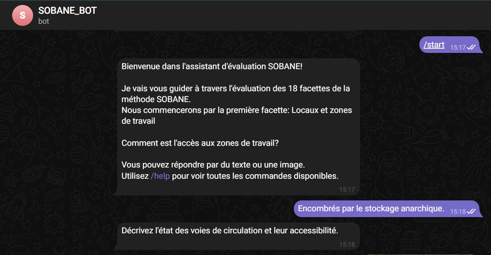
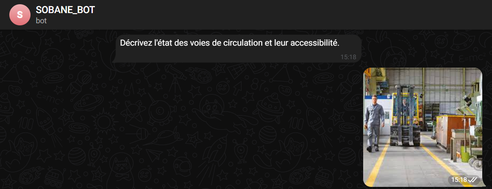
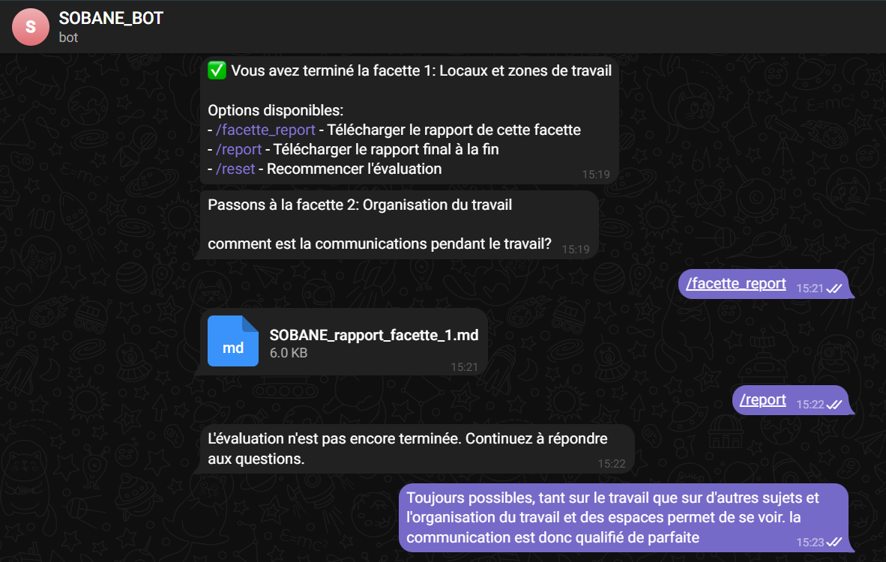
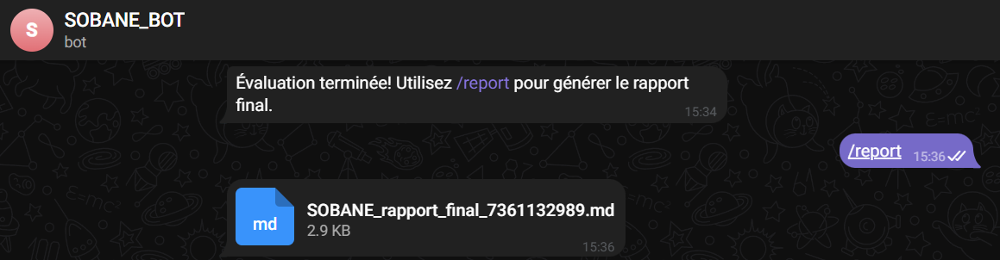

# README for SOBANE Evaluation Chatbot

## Overview
The SOBANE Evaluation Chatbot is a Telegram bot designed to assist users in evaluating workplace safety and ergonomics using the SOBANE method. The bot guides users through a series of questions related to various facets of workplace safety, collects responses, and generates detailed reports based on the analysis of the provided information.

## Features
- **Interactive Evaluation**: Users can respond to questions via text or images.
- **Facette Analysis**: The bot evaluates responses based on 18 different facets of workplace safety.
- **Report Generation**: Users can generate detailed reports summarizing their evaluations and recommendations.
- **User State Management**: The bot tracks user progress and maintains state throughout the evaluation process.

## Technologies Used
- **Python**: The primary programming language for the bot.
- **Pyrogram**: A Python library for Telegram Bot API.
- **Pillow (PIL)**: For image processing and analysis.
- **LangChain**: For handling embeddings and vector storage.
- **Google Generative AI**: For generating content based on user responses.

## Installation
### Prerequisites:
- Python 3.7 or higher.
- A Telegram account and bot token from BotFather.

### Clone the Repository:
```bash
git clone https://github.com/salmaelbinani/SOBANE_BOT.git
cd SOBANE_BOT
```

### Install Dependencies:
Make sure you have Python installed. Then, install the required packages:
```bash
pip install -r requirements.txt
```

### Configuration:
Update the configuration section in `main_script.py` with your own API keys and tokens:
```python
API_ID = "your_api_id"
API_HASH = "your_api_hash"
BOT_TOKEN = "your_bot_token"
GENAI_API_KEY = "your_genai_api_key"
```

### Run the Bot:
Execute the bot using:
```bash
python main_script.py
```

## Folder Structure
```
SOBANE_BOT/
├── VectorDB/           # Vector storage for embeddings
├── image/              # Contains example images for README
├── output/             # Generated reports (Markdown files)
├── main_script.py      # Main bot script
├── requirements.txt    # List of dependencies
└── README.md           # Project documentation
```

## Commands
- **/start**: Begin or restart the evaluation process.
- **/help**: List available commands.
- **/status**: Check the current progress of the evaluation.
- **/report**: Generate a final report of the evaluation.
- **/reset**: Reset the evaluation process.
- **/facette_report**: Generate a report for the current facette.

## Usage
### Initial Interaction: Launch and Start
The user initiates a new session using the `/start` command. The chatbot provides a welcome message explaining its role, available commands, and begins the questioning process by indicating the types of responses it can accept.



### Data Collection: Text and Images
The user can respond to the questions in two ways:
1. By providing textual responses.
2. By submitting images for complementary analyses.



### Facette Progression and Completion
Once all questions for a facette are completed, the chatbot informs the user of the facette's completion and presents options for further actions. These options include:
- Requesting a facette-specific report using the `/facette_report` command. This generates a detailed Markdown file summarizing:
  - Questions asked and responses provided.
  - Positive and negative aspects identified.
  - Overall assessment and recommendations.
- Generating a comprehensive final report with the `/report` command after completing all facettes.
- Receiving a prompt to continue answering pending questions if not all facettes are completed when attempting to use the `/report` command prematurely.



### Evaluation Completion and Final Report
After answering questions for all 18 facettes, the user generates a final report using the `/report` command.



#### Final Report Content:
1. **Facette Summary Table**: Lists all 18 facettes with their respective evaluations.
2. **Detailed Action Plan**: Includes columns for "Who," "What and How," and placeholders for "Cost," "Projected When," and "Realized When," allowing further user customization.

## Output
Generated reports are stored in the `output` folder:
- **Facette Reports**: Intermediate reports for each facette (e.g., `SOBANE_rapport_facette_1.md`).
- **Final Report**: Comprehensive report after completing all facettes (e.g., `SOBANE_rapport_final.md`).

## Contributing
Contributions are welcome! If you have suggestions or improvements, please create a pull request or open an issue.

## License
This project is licensed under the MIT License - see the LICENSE file for details.
